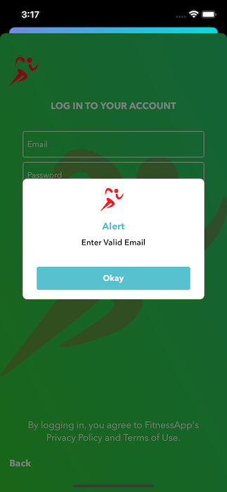
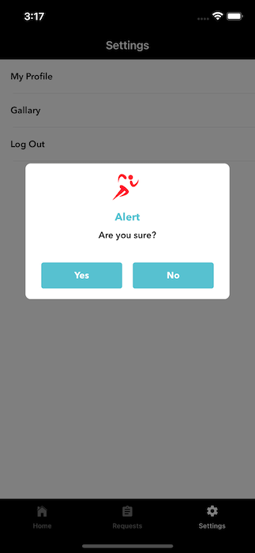

## Introduction

Hi, Humans!

My name is Hamza Farooq and I love 'Swift' programming. I always try to implement new ideas. Do check [Swift-TopViewController](https://github.com/hamza-faroooq/Swift-TopViewController) for this CustomAlertManager to work

# Swift-CustomAlertManager
This class is used to make custom alert

### Images

## Simple Usage

Do the following simple steps to add this Manager class in your project and present this CustomAlert
